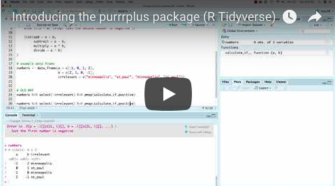

```{r, echo = FALSE}
knitr::opts_chunk$set(collapse = TRUE,
                      fig.path = "man/figures/README-")
set.seed(1014)
```

# purrrplus

The [tidyverse](https://www.tidyverse.org/) is built on the idea that problems are most easily solved within the structure of a data frame. 

The [purrr package](https://purrr.tidyverse.org/) allows for [functional programming](http://adv-r.had.co.nz/Functional-programming.html) that plays well with data frames using the [map functions](https://purrr.tidyverse.org/reference/map2.html) and for capturing errors with the [safely functions](https://purrr.tidyverse.org/reference/safely.html). However, the combination of functional programming and capturing errors in purrr returns a list which does not work well with data frames. 

purrrplus adds functionality to purrr that allows the combination of functional programming and capturing errors to be kept within the structure of a data frame. This is useful for many data analysis tasks and is particularly useful for conducting simulations. 

To learn more about the package, you can either continue reading or watch this video:

[](https://www.youtube.com/watch?v=7QWzuBiHDk8&list=PLLxj8fULvXwGOf8uHlL4Tr62oXSB5k_in)

## Installation

```{r eval=FALSE, message=FALSE}
# install.packages("devtools")
devtools::install_github("stenhaug/purrrplus")
```

## Getting started

```{r message=FALSE}
library(purrrplus)
library(tidyverse) # most useful with the tidyverse
```

### Example

Imagine you have a function with the following properties:

- Returns a named list or a named vector

- Might return an error (you're not sure!) 

```{r}
calculate_if_positive <- function(a, b){
  if(a < 0 & b < 0) {stop("Both numbers are negative.")}
  else if(a < 0) {stop("Just the first number is negative")}
  else if(b < 0) {stop("Just the second number is negative")}
  
  list(add = a + b,
       subtract = a - b,
       multiply = a * b,
       divide = a / b)
}
```

And you want to apply this function to each row of a data frame (which might contain irrelevant variables):

```{r}
(numbers <- data_frame(a = c(-1, 0, 1, 2),
                      b = c(2, 1, 0, -1),
                      irrelevant = c("minneapolis", "st_paul", "minneapolis", "st_paul")))
```

### The old way

The irrelevant variable causes pmap to throw an error:

```{r error = TRUE}
output <- pmap(numbers, calculate_if_positive)
```

One way around this is to remove the irrelevant variables:

```{r}
numbers2 <- select(numbers, -irrelevant)
```

However, now calculate_if_positive function throws an error that stops everything if *any* of the rows contain a negative number:

```{r error = TRUE}
output <- pmap(numbers2, calculate_if_positive)
```

We are applying the function calculate_if_positive 4 times (once for each row in the data frame numbers). It should work for rows 2 and 3 and throw an error for rows 1 and 4. 

The purrrr function safely allows us to capture the results when it works and the error when it doesn't:

```{r}
output <- pmap(numbers2, safely(calculate_if_positive))
```

However, a function wrapped in safely returns a list which is difficult to work with:

```{r}
str(output)
```

### The purrrplus way

pmap_safely is the key function in purrrplus. pmap_safely takes a data frame (which might contain irrelevant variables) and applies a function (which returns a named list or a named vector and might throw an error) to each row. 

pmap_safely adds an error and a result column (which come from applying the function) to the inputted data frame.

```{r}
(output <- pmap_safely(numbers, calculate_if_positive))
```

#### get_errors

get_errors allows for quick analysis of errors:

```{r}
get_errors(output)
```

get_errors with specific = TRUE breaks down the analysis by the specific error:

```{r}
get_errors(output, specific = TRUE)
```

get_results filters out rows with errors and unnests results such that each item in the list that the function returns has its own column:

#### get_results

```{r}
get_results(output)
```

Notice that "_result" is appended to each of these columns so any subsequent analysis can easily differentiate between variables the function produced and variables it didn't.
